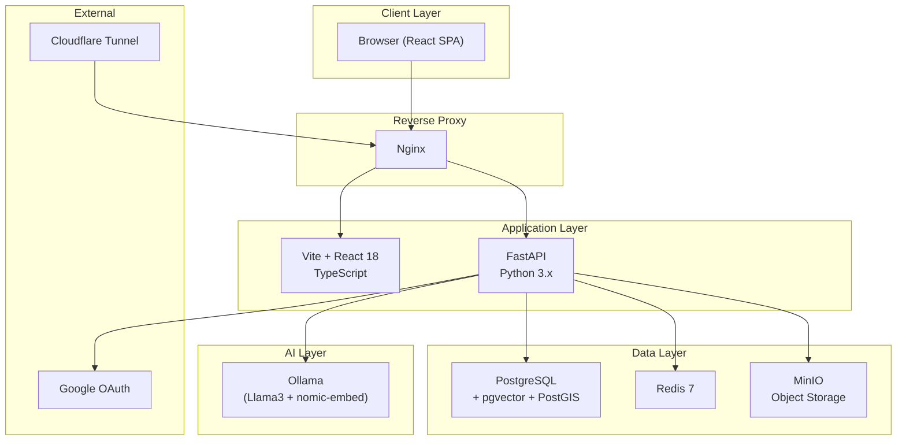

# NavDashboard — Comprehensive Platform Audit

**Prepared for:** NavOS Evolution Planning  
**Date:** July 7, 2026  
**Scope:** Complete platform analysis across 13 phases  
**Method:** Full codebase review + architectural analysis  

---

## Table of Contents

1. [Executive Summary](#executive-summary)
2. [Phase 1 – Platform Architecture](#phase-1--platform-architecture)
3. [Phase 2 – Product Understanding](#phase-2--product-understanding)
4. [Phase 4 – Reverse Engineering the Business](#phase-4--reverse-engineering-the-business)
5. [Phase 5 – Module Analysis](#phase-5--module-analysis)
6. [Phase 6 – Workflow Analysis](#phase-6--workflow-analysis)
7. [Phase 7 – Architecture Analysis](#phase-7--architecture-analysis)
8. [Phase 8 – UI & UX Analysis](#phase-8--ui--ux-analysis)
9. [Phase 9 – Product Identity](#phase-9--product-identity)
10. [Phase 10 – Future Growth](#phase-10--future-growth)
11. [Phase 11 – Daily User Perspective](#phase-11--daily-user-perspective)
12. [Phase 12 – Hidden Insights](#phase-12--hidden-insights)
13. [Phase 13 – Final Audit Report](#phase-13--final-audit-report)

---

## Executive Summary

NavDashboard is an internal operations platform built around the management of **LiFi (Light Fidelity) optical wireless communication devices**. The company appears to be a LiFi technology company (likely in India, based on the default admin username "Madhur," INR currency, Mumbai-related seed data, and Indian Navy references) that deploys optical wireless communication links for clients — including defense organizations (Indian Navy) and international customers (New Zealand).

The software manages the **complete lifecycle** of LiFi deployments: tracking individual device hardware (IU/OU pairs), grouping them into logical "Couples" and "Pairs," tracking their physical locations, managing field personnel, logging troubleshooting incidents, tracking equipment sent to project sites, managing expenses, and providing AI-powered assistance.

**The platform is remarkably well-built for its maturity stage.** It demonstrates thoughtful domain modeling, cascading status propagation, comprehensive audit trails, and a modern glassmorphic dark-mode UI. However, it is clearly in an early-to-mid lifecycle stage with several areas showing conceptual overlap, incomplete integrations, and scaling concerns that need to be addressed before the NavOS evolution.

---

## Phase 1 – Platform Architecture

### Overall Architecture

### Backend Architecture

| Aspect | Detail |
|--------|--------|
| **Framework** | FastAPI (Python) with async/await throughout |
| **ORM** | SQLAlchemy 2.0 (async) with mapped_column declarative style |
| **Database** | PostgreSQL with pgvector (vector search), PostGIS (geometry), JSONB (flexible fields) |
| **Auth** | JWT (HS256) via python-jose, bcrypt password hashing via passlib |
| **Migrations** | Alembic |
| **Architecture** | Modular monolith: `modules/{name}/` each with models, schemas, repository, service, router |
| **File Storage** | MinIO (S3-compatible object storage) |
| **Caching** | Redis (configured but usage not visible in current code) |
| **AI** | Ollama (self-hosted LLM) with RAG pipeline using pgvector embeddings |

**Module structure is consistent:** Every backend module follows `models.py → schemas.py → repository.py → service.py → router.py`. This is a good architectural pattern. 22 backend modules exist.

### Frontend Architecture

| Aspect | Detail |
|--------|--------|
| **Framework** | React 18 + TypeScript |
| **Build** | Vite 6 |
| **UI Library** | Ant Design 5 (heavily themed to dark glassmorphic) |
| **State** | Zustand (2 stores: auth + UI) |
| **Data Fetching** | TanStack React Query + Axios |
| **Routing** | React Router v6 |
| **Charts** | Recharts |
| **Maps** | Leaflet + react-leaflet |
| **Design System** | Custom dark theme applied to Ant Design + glassmorphic CSS components |

21 frontend modules mirror the backend modules.

### Database Design

**Key Tables (28+ tables):**

| Table | Purpose | Soft Delete | Custom Fields |
|-------|---------|:-----------:|:-------------:|
| `users` | Authentication & identity | ✅ | ✅ |
| `user_permissions` | Per-section access control | ❌ | ❌ |
| `devices` | Individual IU/OU/HC/RF units | ✅ | ✅ |
| `device_status_history` | Status change audit trail | ❌ | ❌ |
| `couples` | Logical pairing of OU+IU | ✅ | ✅ |
| `pairs` | Two couples forming a link | ✅ | ✅ |
| `locations` | GPS coordinates for couples | ❌ | ❌ |
| `location_history` | Movement audit trail | ❌ | ✅ |
| `personnel` | Field staff registry | ✅ | ✅ |
| `assignment_history` | Personnel assignment log | ❌ | ❌ |
| `fitting_materials` | Materials per couple | ✅ | ✅ |
| `material_templates` | Reusable material kits | ❌ | ❌ |
| `error_logs` | Troubleshooting tickets | ✅ | ✅ |
| `troubleshoot_entries` | Step-by-step resolution | ❌ | ✅ |
| `documents` | File attachments to entities | ✅ | ❌ |
| `projects` | Client deployments | ✅ | ✅ |
| `project_members` | Team assignments | ❌ | ❌ |
| `project_timeline_entries` | Activity log | ❌ | ❌ |
| `equipment_movements` | Asset check-out/check-in | ❌ | ❌ |
| `equipment_movement_items` | Line items per movement | ❌ | ❌ |
| `assets` | Physical inventory items | ✅ | ✅ |
| `asset_categories` | Hierarchical categories | ❌ | ❌ |
| `asset_history` | Asset lifecycle events | ❌ | ❌ |
| `asset_reports` | Damage/requirement reports | ✅ | ❌ |
| `expenses` | Financial records | ✅ | ✅ |
| `expense_batches` | Expense groupings | ✅ | ❌ |
| `expense_members` | Bill split tracking | ❌ | ❌ |
| `download_items` | Versioned file distribution | ✅ | ❌ |
| `download_versions` | File versions | ❌ | ❌ |
| `download_item_access` | Per-user access control | ❌ | ❌ |
| `chat_sessions` | AI conversation threads | ✅ | ❌ |
| `chat_messages` | AI messages | ❌ | ❌ |
| `embedding_documents` | RAG vector store | ❌ | ❌ |
| `audit_logs` | System-wide audit trail | ❌ | ❌ |
| `system_settings` | Key-value configuration | ❌ | ❌ |

### Authentication & Authorization

**Three-tier system:**

1. **Roles** (legacy): `ADMIN`, `TECHNICIAN`, `VIEWER`
2. **Per-section permissions** (current): 11 sections × 4 levels (`NONE` < `VIEW` < `EDIT` < `MANAGE`)
3. **Google OAuth** with pending-approval flow for new users

**Permission sections:** `devices`, `inventory`, `projects`, `downloads`, `finance`, `personnel`, `documents`, `troubleshooting`, `reports`, `ai`, `admin`

> [!IMPORTANT]
> The permission system is well-designed but the frontend route guards are inconsistent. Some routes use `RequirePermission`, others don't. The `devices`, `couples`, `pairs`, `map` routes have no permission guards in the router despite having a `devices` section in the permission system.

### Infrastructure

- **Containerized** via Docker Compose (7 services: nginx, frontend, backend, db, redis, minio, cloudflared)
- **Cloudflare Tunnel** for external access (production tunnel token hardcoded in docker-compose)
- **Ollama** commented out in docker-compose (likely run on host machine)
- **No CI/CD** visible
- **No test suite** visible

---

## Phase 2 – Product Understanding

### What is this software today?

NavDashboard is an **internal operations platform for a LiFi technology company** that deploys optical wireless communication links. It serves as the company's primary tool for:

1. **Tracking hardware** across its entire lifecycle (from warehouse to field deployment to troubleshooting)
2. **Managing field deployments** (projects with timelines, team members, equipment movements)
3. **Logging and resolving technical issues** (structured troubleshooting with step-by-step entries)
4. **Managing office inventory** (equipment, cables, tools with barcode/RFID readiness)
5. **Tracking field expenses** (per-project expense logging, bill generation)
6. **Distributing internal files** (software releases, manuals, configuration files)
7. **AI-powered assistance** (RAG-based chatbot querying all company data)

### What problem is it solving?

The company deploys and maintains physical LiFi communication links — each consisting of **multiple hardware units (Indoor Unit, Outdoor Unit, possibly an HC controller and RF backup)** installed at client sites. Before NavDashboard, this data was likely tracked in **spreadsheets** (evidenced by the CSV import functionality and the `parse_csv.py` script at the project root).

The core problem: **"Where is every piece of our hardware, what's its current status, who's responsible for it, and what happened to it?"**

### Who are the users?

| User Type | Role | Primary Activities |
|-----------|------|-------------------|
| **Admin / Management** | ADMIN | User management, system settings, full visibility, reports |
| **Field Technician** | TECHNICIAN | Log troubleshooting, update device status, manage couples at sites |
| **Office Staff / Viewer** | VIEWER | View device status, browse documents, check project progress |
| **Finance Person** | (via permissions) | Log expenses, generate bills, import spreadsheets |
| **Site Engineer** | (via permissions) | Manage projects, equipment movements, timeline entries |

### What is already excellent?

1. **Domain Modeling of Device Hierarchy**: The `Device → Couple → Pair` cascade with automatic status propagation is genuinely clever. It mirrors real-world LiFi topology.
2. **Audit Trail**: Every mutation records an audit log. This is non-trivial and shows operational maturity.
3. **Custom Fields (JSONB)**: Most entities support arbitrary custom fields, allowing the system to adapt without schema changes.
4. **AI Integration**: The RAG pipeline with permission-aware retrieval (filtering embedded documents by user's section access) is sophisticated.
5. **Equipment Movement System**: The check-out/check-in flow with status tracking (WITH_CLIENT, RETURNED, DAMAGED, LOST) is well thought out.
6. **Report Generation**: PDF and Excel reports with summary statistics show the system is built for real operational use.
7. **Dark Glassmorphic UI**: The visual design is cohesive and premium-feeling.

### What feels incomplete?

1. **Projects** feel disconnected from the device hierarchy — there's no link between a `Project` and `Couple/Pair/Device`.
2. **Finance** has no approval workflow — expenses are just recorded, not approved.
3. **Downloads** has access control but no notification system for new versions.
4. **The Dashboard** shows device-centric stats but doesn't show project stats, financial summaries, or pending items.
5. **No notifications** of any kind — no alerts for critical errors, pending approvals, or overdue items.
6. **Personnel vs Users** is a split identity — they exist as separate concepts with no link between them.
7. **Search** is admin-only but should be universal.
8. **No mobile-optimized workflows** — the responsive layout works but workflows aren't designed for mobile-first field use.

### Which areas feel like they belong together?

- **Devices + Couples + Pairs + Map + Location History + Comparison** → These are all "Device Lifecycle Management"
- **Projects + Equipment Movements + Project Timeline** → These are "Project Operations"
- **Assets + Inventory (Fitting Materials)** → These are "Asset Management" (currently split)
- **Error Logs + Troubleshooting Steps** → This is "Support & Maintenance"
- **Users + Personnel + Permissions** → This is "People Management" (currently fragmented)

### Which areas feel disconnected?

- **Downloads** feels like a separate internal wiki/file server bolted on
- **Finance** has minimal integration with Projects (only a foreign key)
- **AI Assistant** is a standalone feature with no integration into other screens
- **Documents** (file attachments) vs **Downloads** (versioned file distribution) — two concepts that overlap
- **Inventory (Fitting Materials)** vs **Assets** — two inventory systems with different data models

---

## Phase 4 – Reverse Engineering the Business

### How does this company operate?

Based on the codebase evidence:

1. **The company manufactures or integrates LiFi communication devices** consisting of paired Indoor Units (IU) and Outdoor Units (OU), sometimes with HC controllers and RF backup modules.

2. **Devices are assembled into "Couples"** (a complete communication endpoint: typically 1 OU + 1 IU) and deployed in "Pairs" (two Couples forming a bidirectional link). The naming convention (NAV202122/121OU) suggests an internal lot/serial system tied to fiscal years.

3. **The company serves defense/government clients** (Indian Navy references in seed data, NZ deployments) under what appear to be **POC/Demo/Installation project types**.

4. **Field teams deploy the equipment at client sites.** The equipment is checked out from the office, transported to site, installed, and tracked. The `equipment_movements` system tracks what left the office and whether it came back.

5. **Installation involves mounting hardware at GPS coordinates**, configuring the devices, and installing fitting materials (mounting brackets, cables, sealants). When equipment moves to a new location, the system snapshots the materials and configuration for the audit trail.

6. **Troubleshooting is a core business activity.** The structured error → steps → resolution model suggests the company spends significant effort maintaining deployed links. Issues range from connection loss and signal degradation to hardware faults and RF interference.

7. **Field expenses are tracked per-project** — travel, accommodation, equipment costs. The INR currency default and expense categories suggest Indian operations with international deployments.

8. **The company distributes internal software and documents** via the Downloads module — likely firmware updates, configuration tools, and manuals shared among the team.

### Where does the software reflect real business?

- **Device hierarchy (Device → Couple → Pair)** is clearly domain-specific and well-modeled
- **Status propagation** (if a device is FAULTY, its couple becomes FAULTY, its pair becomes FAULTY) reflects real operational concern
- **Location history with configuration snapshots** reflects the reality of equipment being relocated between sites
- **Fitting materials per couple** reflect the real kit of cables and brackets shipped with each unit
- **The seed data uses real-looking serial numbers and project codes** (NAV202122/121OU), suggesting these patterns exist in the actual business

### Where does it still look generic?

- **Projects** feel like a generic project management module, not deeply tied to LiFi deployment workflows
- **Finance** is basic expense tracking — no purchase orders, invoices, or approval chains
- **Personnel** is a simple contact directory, not a workforce management system
- **Documents** is a generic file uploader with entity tagging
- **The Dashboard** shows generic counts and charts — no domain-specific KPIs like "links uptime" or "pending deployments"

---

## Phase 5 – Module Analysis

### 1. Device Management

| Attribute | Assessment |
|-----------|------------|
| **Purpose** | Track individual LiFi hardware units (IU, OU, HC, RF) |
| **Maturity** | ⭐⭐⭐⭐ High |
| **Strengths** | Unique serial enforcement, status history, cascading propagation, custom fields |
| **Weaknesses** | No firmware version tracking, no connection/telemetry data, no device configuration storage |
| **Dependencies** | Couples (parent), Personnel (handler) |
| **Missing Integration** | No link to Projects, no link to Assets, no maintenance schedule |
| **Scalability** | Solid for hundreds of devices; may need indexing optimization for thousands |

### 2. Couples

| Attribute | Assessment |
|-----------|------------|
| **Purpose** | Logical grouping of OU+IU into a communication endpoint |
| **Maturity** | ⭐⭐⭐⭐⭐ Very High |
| **Strengths** | Rich model (location, configuration, materials, personnel), location change with snapshots, cascade to pairs |
| **Weaknesses** | The name "Couple" is domain jargon that new employees/users may find confusing |
| **Dependencies** | Devices, Locations, Personnel, Pairs, Inventory |
| **Missing Integration** | No link to Projects (a couple deployed at a project site) |

### 3. Pairs

| Attribute | Assessment |
|-----------|------------|
| **Purpose** | Two Couples forming a complete bidirectional LiFi link |
| **Maturity** | ⭐⭐⭐ Medium |
| **Strengths** | Status override flag (manual control), cascading from couples |
| **Weaknesses** | No metadata about the link itself (bandwidth, distance, uptime). No relationship to Projects. |
| **Dependencies** | Couples |
| **Missing Integration** | No project association, no performance metrics |

### 4. Projects

| Attribute | Assessment |
|-----------|------------|
| **Purpose** | Track client deployments (POC, Demo, Installation) |
| **Maturity** | ⭐⭐⭐⭐ High |
| **Strengths** | Rich timeline (visits, calls, notes, auto-events), equipment movements with asset tracking, member management |
| **Weaknesses** | No relationship to Couples/Pairs/Devices. No milestones or phases. No customer contact management. |
| **Dependencies** | Personnel, Assets |
| **Missing Integration** | Critical gap: no link to the device hierarchy. A project deploys Couples/Pairs but the system doesn't track this. |

### 5. Inventory (Fitting Materials + Material Templates)

| Attribute | Assessment |
|-----------|------------|
| **Purpose** | Track installation materials per couple |
| **Maturity** | ⭐⭐ Low-Medium |
| **Strengths** | Template system for reusable kits, materials copied from one couple to another |
| **Weaknesses** | No warehouse stock tracking, no consumption tracking, no reorder alerts |
| **Dependencies** | Couples |
| **Missing Integration** | Not linked to Assets module (conceptual overlap) |

### 6. Assets

| Attribute | Assessment |
|-----------|------------|
| **Purpose** | Track all physical items: equipment, cables, tools |
| **Maturity** | ⭐⭐⭐⭐ High |
| **Strengths** | Auto-generated codes (AST-00001), hierarchical categories, barcode/QR/RFID readiness, damage reports, requirements tracking, full history log |
| **Weaknesses** | Overlaps conceptually with Inventory (fitting materials) and Devices |
| **Dependencies** | Personnel, Projects |
| **Missing Integration** | `device_id` field exists but isn't enforced or used in workflows |

### 7. Finance

| Attribute | Assessment |
|-----------|------------|
| **Purpose** | Track project-related expenses |
| **Maturity** | ⭐⭐⭐ Medium |
| **Strengths** | Per-project expense linking, batch grouping, bill split (expense members), CSV/XLSX import, PDF bill generation, summary analytics |
| **Weaknesses** | No approval workflow, no budgets, no purchase orders, no receipt attachments |
| **Dependencies** | Projects, Personnel |
| **Missing Integration** | No Document attachments for receipts |

### 8. Troubleshooting

| Attribute | Assessment |
|-----------|------------|
| **Purpose** | Log, track, and resolve technical issues |
| **Maturity** | ⭐⭐⭐⭐ High |
| **Strengths** | Multi-entity linking (device, couple, pair, project, asset), structured step-by-step entries, auto-set FAULTY status with cascade, project timeline integration, rich filtering |
| **Weaknesses** | No SLA tracking, no priority escalation, no assignment workflow |
| **Dependencies** | Devices, Couples, Pairs, Personnel, Projects |
| **Missing Integration** | No notification when critical errors are logged |

### 9. Downloads

| Attribute | Assessment |
|-----------|------------|
| **Purpose** | Distribute versioned files (software, manuals) |
| **Maturity** | ⭐⭐⭐⭐ High |
| **Strengths** | Versioning, per-user access control (RESTRICTED visibility), categories, download counting, MinIO storage |
| **Weaknesses** | No changelog system, no automatic notification of new versions |
| **Dependencies** | MinIO, Users |
| **Missing Integration** | Could be linked to Devices (firmware for specific device types) |

### 10. AI Assistant

| Attribute | Assessment |
|-----------|------------|
| **Purpose** | Natural language query of company data |
| **Maturity** | ⭐⭐⭐⭐ High |
| **Strengths** | Hybrid retrieval (vector + structured), permission-aware data filtering, streaming responses, session management, configurable model |
| **Weaknesses** | Requires self-hosted Ollama, no multi-modal support, no ability to take actions |
| **Dependencies** | Ollama, pgvector, all data modules |
| **Missing Integration** | Not embedded into other modules (could assist in troubleshooting, for example) |

### 11. Reports

| Attribute | Assessment |
|-----------|------------|
| **Purpose** | Generate PDF/XLSX reports |
| **Maturity** | ⭐⭐⭐ Medium |
| **Strengths** | 4 report types (device inventory, error summary, location history, pair status) in both PDF and XLSX, summary statistics |
| **Weaknesses** | No scheduled reports, no email delivery, no custom report builder |
| **Dependencies** | All data modules |

### 12. Admin Panel (Settings + Users + Backup + Audit)

| Attribute | Assessment |
|-----------|------------|
| **Purpose** | System administration |
| **Maturity** | ⭐⭐⭐ Medium |
| **Strengths** | Per-section permission management, Google OAuth pending approval, system settings, audit trail |
| **Weaknesses** | No email/notification system, no system health monitoring, backup functionality scope unclear |

---

## Phase 6 – Workflow Analysis

### Adding a Device

**Current flow:** Admin/Tech → Device list → Add → Enter serial, type, status → Save  
**Pain points:** No validation of serial number format. No guidance on device type selection. No automatic couple association.  
**Missing automation:** Could auto-suggest couple assignment based on serial number patterns. No bulk import.

### Creating a Project

**Current flow:** User → Projects → Create → Fill form (name, type, customer, location) → Save → Add members → Add timeline entries → Record equipment movements  
**Pain points:** No project template. Manual location entry (no map picker). No integration with device deployment.  
**Missing relationships:** Cannot assign Couples/Pairs to a project. Cannot track which communication links are deployed at the project site.

### Managing Inventory

**Current flow:** Two separate systems: 1) Fitting Materials per Couple, 2) Assets module  
**Pain points:** User must mentally track which system to use. Fitting materials are per-couple only (no warehouse view). Assets module is disconnected from the device hierarchy.  
**Friction:** Creating an asset requires manual code entry or auto-generation. No way to scan a barcode in the current UI.

### Troubleshooting an Issue

**Current flow:** User → Troubleshooting → Create Error → Link to device/couple/pair → Add steps → Mark resolved  
**Pain points:** No guided troubleshooting templates. No knowledge base from past resolutions. No automatic notification to relevant team members.  
**Missing automation:** AI could suggest resolution steps based on similar past issues. Status should auto-update when resolved.

### Submitting Expenses

**Current flow:** User → Finance → Add Expense → Fill details → Optionally link to project → Add expense members  
**Pain points:** No receipt upload. No approval workflow. No budget comparison.  
**Missing relationships:** Cannot attach Document uploads to expenses.

### Permission Management

**Current flow:** Admin → Settings → Users → Select user → Set per-section permission levels  
**Pain points:** No role templates (must configure each section individually). No bulk permission assignment. No permission inheritance.  
**Friction:** 11 sections × 4 levels = 44 individual permission decisions per user.

---

## Phase 7 – Architecture Analysis

### Good Architectural Decisions

| Decision | Why It's Good |
|----------|---------------|
| **Modular monolith** | Clean separation of concerns without microservice complexity |
| **Consistent module structure** | Every module follows the same pattern — easy to learn and maintain |
| **Soft delete everywhere** | Data preservation for audit compliance |
| **Custom fields (JSONB)** | Schema flexibility without migration overhead |
| **Async throughout** | FastAPI + asyncpg = high concurrent throughput |
| **Status propagation** | Business rules encoded in shared utilities, not scattered |
| **Audit trail** | System-wide mutation tracking |
| **Permission-aware AI retrieval** | Security built into the AI from day one |

### Weak Architectural Decisions

| Decision | Why It's Problematic |
|----------|---------------------|
| **No foreign key constraints on many relationships** | `Device.couple_id` has no FK constraint (comment: "FK added in Phase 6"). Several UUID columns reference other tables without FK enforcement. |
| **Circular imports via lazy imports** | Many services use `from modules.X.Y import Z` inside functions to avoid circular imports. This is a code smell. |
| **Duplicated exception handlers** | Exception handlers are defined twice: once in `main.py` inline and once in `exceptions.py`'s `register_exception_handlers()`. |
| **Redis configured but unused** | Redis is a running service with no visible usage in the codebase. |
| **CORS allow_origins=["*"]** | Wide-open CORS in production is a security risk. |
| **Hardcoded Cloudflare tunnel token** | Sensitive token committed to docker-compose.yml. |
| **No test suite** | Zero test files in the entire project. |
| **Secret key in .env** | `SECRET_KEY=change-me-in-production-1234` — clearly a placeholder but committed. |

### Tight Coupling

- **Troubleshooting service** imports from `devices`, `couples`, `pairs`, `projects`, `personnel`, and `shared.propagation`. It's the most coupled module.
- **Couples service** imports from `devices`, `inventory`, `locations`, `personnel` repositories and services.
- **Projects service** imports from `assets` service. `Finance service` imports from `projects` service. This creates a diamond dependency pattern.

### Duplicate Logic

- **Two seed systems**: `shared/seed.py` (standalone script) and inline `seed_*` methods in several service files (devices, couples, troubleshooting). They create different data.
- **Status colors** defined in both `devices/constants.py` and `couples/service.py` with slightly different hex values.
- **Pagination**: The `couples/service.py` reimplements pagination manually instead of using the shared `paginate()` utility.
- **Two inventory concepts**: `FittingMaterial` (per-couple materials) and `Asset` (general inventory) with overlapping purposes.

### Technical Debt

1. **No database migration history visible** — `alembic.ini` exists but migration files aren't examined in depth.
2. **No input validation beyond Pydantic** — SQL injection is prevented by ORM but business rule validation is inconsistent.
3. **MinIO client uses synchronous operations** wrapped in async methods — potential thread pool starvation under load.
4. **QA bot** (`qa_bot/crawler.py`) exists as a standalone Python script with no integration into the main application.
5. **`parse_csv.py`** at project root — orphaned utility script.

---

## Phase 8 – UI & UX Analysis

### Visual Design

**Strengths:**
- **Cohesive dark theme** — The glassmorphic dark design (bg: `#0A0A0A`, card: `#141414`, blur backdrops) is premium-feeling and consistent.
- **Well-defined color system** — Theme file defines colors for every concept: status, severity, roles, charts, audit events, chat bubbles.
- **Ant Design theming** — Deep customization of Ant Design components to match the dark aesthetic.

**Weaknesses:**
- **Low contrast in some areas** — Muted text (`#7A7A7A`) on dark background (`#0A0A0A`) may challenge readability for some users.
- **Monochromatic palette** — The grayscale palette, while elegant, makes different sections of the app look identical. There's no visual way to know "I'm in Projects" vs "I'm in Finance."
- **No brand identity beyond logo** — The app lacks visual personality beyond "dark and clean."

### Navigation

**Strengths:**
- **Collapsible sidebar** — State persisted in localStorage.
- **Mobile drawer** — Responsive sidebar via Ant Design Drawer.
- **Permission-aware sidebar** — Menu items hidden based on user's section access.

**Weaknesses:**
- **Flat navigation (20 items)** — The sidebar lists all 20 navigation items in a flat list with no grouping. As the product grows, this will become overwhelming.
- **No breadcrumbs** on most pages (the `Breadcrumb` component is themed but not widely used).
- **No search from the header** — Global search should be accessible from the top bar.
- **"Admin" as a menu item** — The settings page is labeled "Admin" in the sidebar, which is confusing because "Admin" is also a role.

### Information Architecture

**Strengths:**
- **Detail pages** for devices, couples, pairs, and projects provide rich, focused views.
- **DataTable** shared component standardizes list views.
- **StatusBadge** component provides consistent status visualization.

**Weaknesses:**
- **No contextual cross-linking** — Viewing a device doesn't show its couple, pair, or error history in context.
- **No dashboard widgets** — The dashboard is a fixed layout, not configurable per user or role.
- **Empty state handling** — EmptyState component exists but may not be used consistently across all modules.

### Forms

**Strengths:**
- **GlassInput, GlassButton, GlassModal** — Custom components that maintain the design system.
- **Confirmation dialogs** via ConfirmDialog component.

**Weaknesses:**
- **No form wizards** for complex multi-step operations (creating a couple with devices, location, and materials).
- **No auto-save or draft mode**.
- **No inline editing** — Every edit requires opening a modal or separate form.

---

## Phase 9 – Product Identity

### What kind of software is NavDashboard today?

NavDashboard is a **Vertical Internal Operations Platform for LiFi Deployment & Maintenance**.

It is **not** a generic ERP, CRM, or asset management tool. It is purpose-built for a company whose core business is deploying and maintaining optical wireless communication links.

**It most closely resembles a Field Service Management (FSM) platform** combined with:
- **Asset/Device Lifecycle Management** (tracking hardware from warehouse to deployment to decommission)
- **Project Management Lite** (tracking deployments with timelines and equipment)
- **Internal Knowledge Base** (downloads, AI assistant)
- **Expense Management Lite** (simple expense tracking)

**The identity tension:** The product tries to be both a **field operations tool** (for technicians deploying and troubleshooting hardware) and a **back-office management tool** (for admins managing users, generating reports, tracking finances). These are fundamentally different UX paradigms — field tools need to be fast, mobile-first, and task-oriented; back-office tools need to be comprehensive, analytical, and data-dense.

---

## Phase 10 – Future Growth

### Where the current architecture will struggle in 5 years

#### Navigation & Sidebar
With 20+ sidebar items already, adding modules for contracts, customers, SLA tracking, certifications, and scheduling will make the sidebar unusable. **Flat navigation cannot scale beyond ~10 items without grouping.**

#### Permissions
11 permission sections with 4 levels is manageable for 10 users. At 100+ users, configuring each user's 11 sections individually becomes operationally painful. **Need role templates and permission groups.**

#### Search
Search is admin-only and uses basic ILIKE queries. At scale, **full-text search (tsvector) or Elasticsearch** will be needed. Users need universal search from the header.

#### Performance
- `list_couples` builds each response by querying devices, materials, and locations **per couple** inside a loop (N+1 queries). At 500+ couples, this will be unacceptably slow.
- The dashboard queries multiple tables sequentially. At scale, these should be **materialized views or cached aggregations**.
- AI vector search over thousands of embedding documents may need HNSW index tuning.

#### Data Relationships
The **Project ↔ Device Hierarchy gap** is the most critical structural debt. As the company scales to dozens of projects with hundreds of devices, the inability to answer "which devices are deployed at this project" or "which project is this couple serving" will become a daily frustration.

#### Mobile
Field technicians are the primary operational users, but the application has no offline capability, no progressive web app features, and no touch-optimized workflows. **Mobile-first field interfaces will be essential.**

#### AI
Currently limited to a chat interface. Future needs: **AI-powered alerting** (predict failures from error patterns), **AI-assisted troubleshooting** (suggest resolution steps), **natural language reporting** ("Show me all faulty devices in Mumbai projects").

#### Multi-tenancy
The current single-tenant architecture will struggle if the company starts serving multiple clients with their own data isolation requirements.

---

## Phase 11 – Daily User Perspective

### Site Engineer

**Would love:** Project timeline, equipment movement tracking, the ability to log visits and calls.  
**Would be annoyed by:** Cannot see which Couples/Pairs are deployed at their project. Must switch to a different module to check device status. No mobile-optimized view for field use.  
**Would slow them down:** Creating equipment movements requires knowing asset codes. No barcode scanning.  
**Would confuse them:** "Assets" vs "Inventory" — where do I track the cable I just used?

### Inventory Manager

**Would love:** Asset categorization, auto-generated codes, damage reporting.  
**Would be annoyed by:** Two separate inventory systems (Fitting Materials per Couple + general Assets). No stock level alerts. No purchase order system.  
**Would slow them down:** Cannot do bulk operations (add 50 cables at once). No warehouse location tracking.  
**Would confuse them:** When an asset is checked out to a project, there's no easy way to see all assets currently deployed.

### Finance Person

**Would love:** Per-project expense tracking, CSV/XLSX import, PDF bill generation.  
**Would be annoyed by:** No receipt attachment. No approval workflow. No budget tracking.  
**Would slow them down:** Must manually type every expense or prepare a spreadsheet. No recurring expenses.  
**Would confuse them:** "Expense Members" (bill splitting) is a niche feature that adds complexity to every expense entry.

### Admin

**Would love:** Full audit trail, user management, per-section permissions, system settings.  
**Would be annoyed by:** Must configure 11 permission sections per user. No role templates. No bulk user operations.  
**Would slow them down:** No dashboard showing pending approvals, unresolved critical errors, or overdue projects.  
**Would confuse them:** "Personnel" and "Users" are separate systems. If a new team member joins, do I create a User or a Personnel record? Both?

### Support Engineer

**Would love:** Structured troubleshooting with steps. Linking errors to specific devices and couples.  
**Would be annoyed by:** No knowledge base of past resolutions. No SLA tracking. No notification when a critical error is logged.  
**Would slow them down:** Creating a new error requires manually filling all fields. No quick-log from a device detail page.  
**Would confuse them:** Error can be linked to device, couple, pair, project, OR asset — but not multiple. Which one should they link it to?

### Management

**Would love:** Dashboard overview, reports, audit trail.  
**Would be annoyed by:** Dashboard only shows device-centric stats. No project health overview. No financial summary. No "attention required" items.  
**Would slow them down:** Must generate reports manually. No scheduled reports. No email notifications.  
**Would confuse them:** The relationship between Projects and the device hierarchy is opaque.

---

## Phase 12 – Hidden Insights

### 1. The Personnel/Users Split is a Conceptual Flaw

**Finding:** `Users` (login accounts) and `Personnel` (field staff) are completely separate entities with no foreign key relationship. A real person could have a User record for system access AND a Personnel record for field assignments. There's no way to link them.

**Why it matters:** This creates data duplication and identity confusion. If "Ahmed" is both a system user and a field technician, his activities are split across two unrelated records.  
**Severity:** 🔴 High  
**Confidence:** 95%

### 2. Three Overlapping Inventory Concepts

**Finding:** The system has three ways to track physical items: `Devices` (LiFi hardware), `FittingMaterials` (per-couple installation materials), and `Assets` (general physical inventory). The `Asset` model even has a `device_id` field, suggesting an awareness of the overlap, but it's not used in any workflow.

**Why it matters:** Users must decide which system to use for each item. Over time, some items will be tracked in multiple systems, creating data inconsistency.  
**Severity:** 🟡 Medium-High  
**Confidence:** 90%

### 3. The Project ↔ Device Hierarchy Gap

**Finding:** Projects track equipment movements (which `Assets` were sent to a site) but have no relationship to the `Device/Couple/Pair` hierarchy. This means the core question — "Which LiFi links are deployed at this project?" — cannot be answered by the system.

**Why it matters:** This is the central business question. Every project exists to deploy LiFi links. The inability to answer this question means the system's two most important domains are disconnected.  
**Severity:** 🔴 Critical  
**Confidence:** 98%

### 4. Cascading Status Propagation Has No Undo

**Finding:** When a device is set to FAULTY, its couple and pair are automatically set to FAULTY via `propagate_device_status_change`. But when the device is later fixed and set to WORKING, the couple/pair status is re-derived from all children. If one of two devices in a couple is still FAULTY, the couple remains FAULTY — which is correct. But there's no visibility into *why* a couple is FAULTY (which specific device caused it).

**Why it matters:** Troubleshooting cascaded status requires manually checking each child entity.  
**Severity:** 🟡 Medium  
**Confidence:** 85%

### 5. MinIO Storage is Synchronous Under the Hood

**Finding:** The `MinIOStorage` class wraps synchronous `minio` client calls in async methods without using `run_in_threadpool`. This means file upload/download operations block the async event loop.

**Why it matters:** Under concurrent load, file operations could starve the event loop and cause request timeouts across the entire API.  
**Severity:** 🟡 Medium-High  
**Confidence:** 95%

### 6. Couples Pagination is Manually Reimplemented

**Finding:** The `list_couples` function in `couples/service.py` manually implements pagination with a loop that calls `_build_couple_response()` for each couple (which executes 2-3 additional queries per couple). The shared `paginate()` utility is not used because the response requires joining data from multiple tables.

**Why it matters:** This is an N+1 query problem. Listing 20 couples triggers ~60-80 database queries. At scale, this page will be the slowest in the application.  
**Severity:** 🔴 High  
**Confidence:** 95%

### 7. The QA Bot is Orphaned

**Finding:** `qa_bot/crawler.py` exists at the project root — a standalone web crawler script. It's not referenced anywhere in the application code, tests, or CI/CD.

**Why it matters:** Dead code that creates maintenance confusion.  
**Severity:** 🟢 Low  
**Confidence:** 90%

### 8. Documents vs Downloads — Conceptual Duplication

**Finding:** `Documents` module: file uploads attached to entities (generic file storage). `Downloads` module: versioned file distribution with access control and categories. Both store files in MinIO. Both track uploaded_by and file metadata. The distinction is that Documents are "attached to something" while Downloads are "shared with someone" — but this is a UX distinction, not an architectural one.

**Why it matters:** Users will be confused about where to upload files. Consolidating into a single file management system with tagging and access control would be simpler.  
**Severity:** 🟡 Medium  
**Confidence:** 85%

### 9. No Database Indexes for Common Query Patterns

**Finding:** Several common query patterns lack optimized indexes:
- `ErrorLog` is frequently filtered by `resolved` status + `severity`, but no composite index exists.
- `Asset` searches by `name`, `asset_code`, and `serial_number` with ILIKE, but only `asset_code` has an index.
- `EquipmentMovementItem.item_status` is queried in project summaries but has no index.

**Why it matters:** Performance degradation as data volume grows.  
**Severity:** 🟡 Medium  
**Confidence:** 80%

### 10. Google OAuth Token Hardcoded as Empty

**Finding:** `GOOGLE_CLIENT_ID=` in `.env` — Google OAuth is configured in the code but the client ID is empty, meaning it's not active. The auth flow is complete and well-implemented but can't function until configured.

**Why it matters:** Low impact — just needs configuration. But it means the pending-approval flow has never been tested in production.  
**Severity:** 🟢 Low  
**Confidence:** 90%

### 11. Cloudflare Tunnel Token in Version Control

**Finding:** The `docker-compose.yml` file contains a hardcoded Cloudflare tunnel token. This is a production secret committed to the repository.

**Why it matters:** Security vulnerability. Anyone with repository access can access the Cloudflare tunnel configuration.  
**Severity:** 🔴 High  
**Confidence:** 98%

### 12. The Frontend Auth Initialization Race Condition

**Finding:** The `authStore.initialize()` method restores the JWT token from localStorage but does NOT restore the user object. This means on page refresh, `token` is set but `user` is null until the `/auth/me` API call completes. During this window, permission checks may fail because `user.permissions` is undefined.

**Why it matters:** On slow connections, users may briefly see permission-denied redirects on page refresh before the auth state is fully restored.  
**Severity:** 🟡 Medium  
**Confidence:** 85%

---

## Phase 13 – Final Audit Report

### Summary of Findings

| # | Finding | Severity | Long-term Impact | Confidence |
|---|---------|----------|------------------|------------|
| 1 | **Project ↔ Device hierarchy disconnection** | 🔴 Critical | Core business question unanswerable | 98% |
| 2 | **Personnel/Users identity split** | 🔴 High | Data duplication, identity confusion | 95% |
| 3 | **Three overlapping inventory systems** | 🟡 Medium-High | User confusion, data inconsistency | 90% |
| 4 | **Flat sidebar navigation (20 items)** | 🟡 Medium-High | Unusable at 30+ modules | 95% |
| 5 | **N+1 queries in couples listing** | 🔴 High | Performance degradation at scale | 95% |
| 6 | **Synchronous MinIO operations** | 🟡 Medium-High | Event loop blocking under load | 95% |
| 7 | **No test suite** | 🔴 High | Regression risk, refactoring friction | 100% |
| 8 | **Cloudflare tunnel token in VCS** | 🔴 High | Security vulnerability | 98% |
| 9 | **CORS allow_origins=["*"]** | 🟡 Medium | Security risk in production | 100% |
| 10 | **Inconsistent frontend permission guards** | 🟡 Medium | Unauthorized page access for non-admin users | 90% |
| 11 | **No notifications system** | 🟡 Medium-High | Missed critical events, manual monitoring | 95% |
| 12 | **Documents vs Downloads duplication** | 🟡 Medium | User confusion about file management | 85% |
| 13 | **Redis unused** | 🟢 Low | Wasted infrastructure resource | 95% |
| 14 | **No mobile-optimized field workflows** | 🟡 Medium-High | Poor field technician productivity | 90% |
| 15 | **Dashboard lacks business KPIs** | 🟡 Medium | Management can't get quick answers | 90% |
| 16 | **No approval workflows (finance, users)** | 🟡 Medium | No accountability in expense/user management | 85% |
| 17 | **Duplicate seed systems** | 🟢 Low | Maintenance confusion | 90% |
| 18 | **Auth initialization race condition** | 🟡 Medium | Brief permission failures on page refresh | 85% |
| 19 | **Circular import workarounds** | 🟡 Medium | Architectural fragility | 90% |
| 20 | **No database indexes for common queries** | 🟡 Medium | Performance degradation at scale | 80% |
| 21 | **Hardcoded secrets in config files** | 🔴 High | Security vulnerability | 98% |
| 22 | **Duplicate exception handlers** | 🟢 Low | Code maintenance confusion | 95% |
| 23 | **No scheduled reports or alerting** | 🟡 Medium | Manual monitoring overhead | 90% |
| 24 | **Pairs module too thin** | 🟡 Medium | Missing link performance/uptime data | 80% |
| 25 | **No offline/PWA capability** | 🟡 Medium-High | Field usage requires connectivity | 85% |

### Top 5 Strategic Findings for NavOS Evolution

1. **The Device Hierarchy ↔ Project Integration is the #1 architectural gap.** The system's two most important domain concepts (hardware tracking and deployment management) don't connect. Closing this gap should be the foundation of NavOS.

2. **The People model needs unification.** Personnel and Users must be merged or linked. Every person in the system — whether they log in or just appear in field assignments — should be a single entity.

3. **Inventory consolidation is overdue.** Devices, Fitting Materials, and Assets are three facets of one concept: "physical things the company owns." NavOS should have a unified inventory model with different views.

4. **Navigation must be restructured before adding more modules.** The current flat sidebar with 20 items is at its limit. NavOS needs grouped navigation with workspaces or contexts (Field Operations, Back Office, Admin).

5. **Mobile-first field workflows are essential for adoption.** The application's most important users (field technicians) have the least optimized experience. NavOS should prioritize task-oriented mobile interfaces for field operations.

---

> [!NOTE]
> This audit is based on comprehensive codebase analysis. It does not include production performance metrics, user interviews, or analytics data. Findings should be validated against actual user feedback and production telemetry where available.
